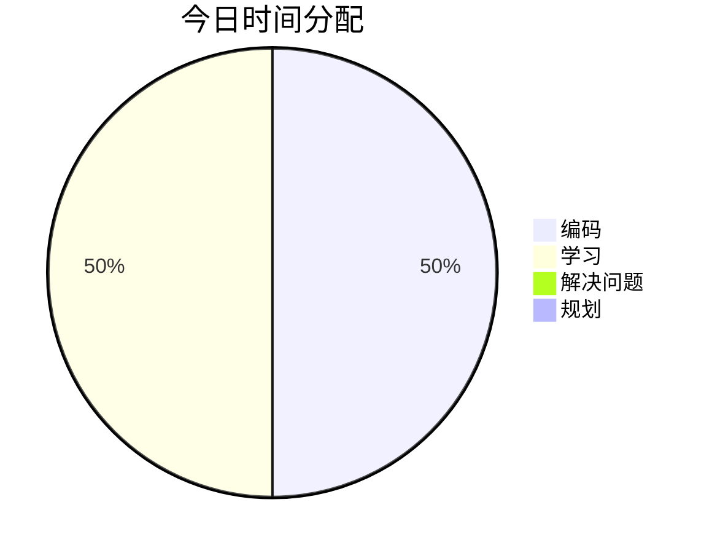

## ⏰ 时间分配

## 📝 今日完成
- [x] 学习CSS基础概念 ✅ 2026-01-17

### 技术学习
- 学习CSS基础概念

### 项目进展
```dataviewjs
// 1. 获取所有标记为“项目”的笔记
const pages = dv.pages('"1-Projects"').where(p => p.project);

// 2. 定义看板的列（根据你的status字段值自定义）
const columns = ["待处理", "进行中", "已完成"];
const statusMap = {
  "todo": "待处理",
  "doing": "进行中",
  "done": "已完成"
};

// 3. 为每一列渲染卡片
for (let col of columns) {
  // 筛选出该列下的所有笔记
  const filesInColumn = pages.where(p => statusMap[p.status] === col);

  // 渲染列标题和卡片列表
  dv.header(3, col + ` (${filesInColumn.length})`);
  dv.list(filesInColumn.file.link);
}
```

### 问题解决


## 💡 今日收获
- CSS 选择器 基本、 关系、伪类、伪元素、属性
- CSS盒模型 width、height、border、padding
- box-sizing的使用
- 行内元素和块元素的转换以及元素隐藏

## 🎯 明日计划
- [ ] 学习CSS布局系统

## 📈 进度追踪

**学习进度**：学习CSS体系知识 0% → 14%
**项目进度**：