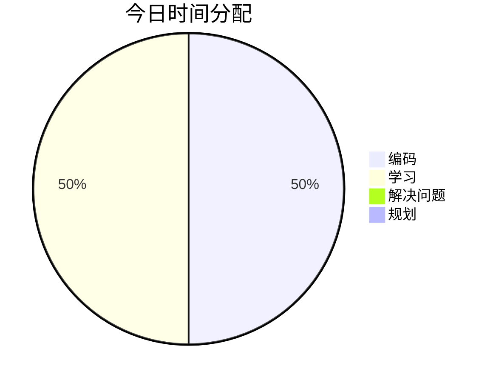

## ⏰ 时间分配

## 📝 今日完成
- [x] 学习CSS基础概念 ✅ 2026-01-17

### 技术学习
- 学习CSS基础概念

### 项目进展

### 问题解决

## 💡 今日收获
- CSS 选择器 基本、 关系、伪类、伪元素、属性
- CSS盒模型 width、height、border、padding
- box-sizing的使用
- 行内元素和块元素的转换以及元素隐藏

## 🎯 明日计划
- [ ] 学习CSS布局系统

## 📈 进度追踪

**学习进度**：学习CSS体系知识 0% → 14%
**项目进度**：