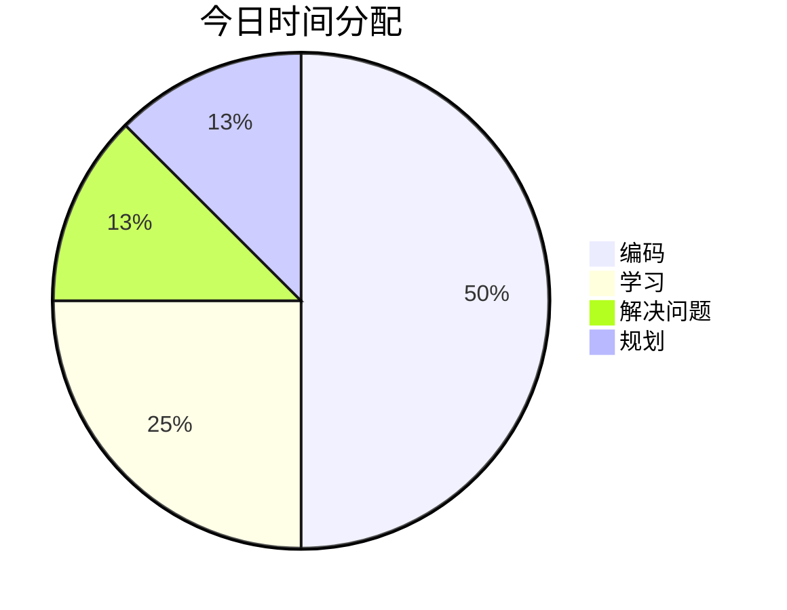

## ⏰ 时间分配


### 📋 项目进展
```dataviewjs
// 1. 定义数据来源：可以按文件夹或标签筛选
// 示例A：获取指定文件夹下的所有笔记
const pages = dv.pages('"01-项目"');
// 示例B：或获取包含特定标签（如#项目）的所有笔记
// const pages = dv.pages('#项目');

// 2. 定义看板的列，与你“状态”字段的值保持一致
const columns = ["待处理", "进行中", "已完成"];

// 3. 为每一列渲染卡片
for (let col of columns) {
    // 筛选出“状态”字段等于当前列名的笔记
    const filesInColumn = pages.where(p => p.状态 === col);
    
    // 渲染列标题（包含该列下的笔记数量）
    dv.header(3, col + ` (${filesInColumn.length})`);
    
    // 以列表形式渲染卡片，显示笔记链接和优先级（如果存在）
    dv.list(filesInColumn.map(p => {
        let display = p.file.link;
        if (p.优先级) {
            display += ` ➜ 优先级：${p.优先级}`;
        }
        return display;
    }));
}
```

## 📈 进度追踪

**项目进度**：
```dataviewjs
// 使用 DataviewJS 查询 Tasks 插件的数据
const pages = dv.pages('#项目')
  .where(p => p.状态 === "进行中")
  .where(p => !p.file.path.includes("_Templates/"));

if (pages.length === 0) {
    dv.paragraph("当前没有进行中的技术栈项目");
} else {
    let tableData = [];
    
    for (let page of pages) {
        // 查询该页面中的所有任务
        const tasks = dv.pages(`"${page.file.path}"`).file.tasks;
        
        if (tasks && tasks.length > 0) {
            const completedTasks = tasks.filter(t => t.completed).length;
            const totalTasks = tasks.length;
            const progressPercent = Math.round((completedTasks / totalTasks) * 100);
            
            // 创建简洁的进度条
            const progressBar = createSimpleProgressBar(progressPercent);
            
            tableData.push([
                page.file.link,
                progressBar,
                `${progressPercent}%`,
                `${completedTasks}/${totalTasks}`,
                page.截止时间 ? dv.date(page.截止时间).toFormat("MM-dd") : "-"
            ]);
        } else {
            // 如果没有找到任务，使用其他方法
            const content = page.file.content || "";
            const allTasks = content.match(/^\s*(?:>\s*)?[*-]\s*\[( |x|X|\/)\].*$/gm) || [];
            const completedTasks = allTasks.filter(task => 
                /\[(x|X|\/)\]/.test(task)
            ).length;
            
            const totalTasks = allTasks.length;
            const progressPercent = totalTasks > 0 ? 
                Math.round((completedTasks / totalTasks) * 100) : 0;
            
            tableData.push([
                page.file.link,
                createSimpleProgressBar(progressPercent),
                `${progressPercent}%`,
                `${completedTasks}/${totalTasks}`,
                page.截止时间 ? dv.date(page.截止时间).toFormat("MM-dd") : "-"
            ]);
        }
    }
    
    // 按进度排序
    tableData.sort((a, b) => {
        const percentA = parseInt(a[2]);
        const percentB = parseInt(b[2]);
        return percentB - percentA; // 降序排列
    });
    
    dv.table(
        ["项目", "进度", "完成率", "任务", "截止"],
        tableData
    );
}

function createSimpleProgressBar(percent) {
    const width = 10;
    const filled = Math.floor(percent / (100 / width));
    const empty = width - filled;
    
    const filledChar = '■';
    const emptyChar = '□';
    
    return `<span style="color: #1dd1a1">${filledChar.repeat(filled)}</span>` +
           `<span style="color: #636e72">${emptyChar.repeat(empty)}</span>`;
}
```

## 📝 今日完成

- 学习JavaScript数组，包装类型，值类型和引用类型

### 🔧 问题解决

- 

### 📚 技术学习

- 学习JS数组，包装类型，Math对象

## 🎯 明日计划

- 学习Date对象，DOM
