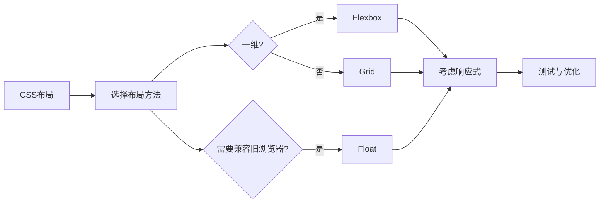

## 📚 定义

CSS布局系统是前端开发的核心技能，决定了页面元素的排列方式。其发展历程：

| 时期 | 主流布局 | 特点 |
|------|---------|------|
| **早期** | Table布局 | 简单但语义差，扩展性弱 |
| **中期** | Float + Margin | 技巧性强，需要理解浮动机制 |
| **现代** | Flexbox / Grid | 偏简单，语义好，功能强大 |

**响应式布局**已成为必备技能，适应不同设备尺寸。

---

## 💡 核心概念

### 布局方法体系

> 基础前置知识
- [[03-CSS深入/盒模型]] - 布局尺寸计算的基础
- [[06-响应式设计/行内元素与块元素]] - 元素类型决定布局行为

> 主要布局技术
- [[05-布局系统/table表格布局]] - 历史遗留，用于表格数据
- [[05-布局系统/float浮动+margin布局]] - 经典三栏布局技术
- [[05-布局系统/inline-block布局]] - 简单水平排列
- [[05-布局系统/flexbox布局]] ⭐ - 一维布局首选，推荐
- [[grid布局]] ⭐ - 二维布局首选，推荐
- [[06-响应式设计/响应式布局]] - 多端适配必备

---

## 🎯 布局选择指南

### Flexbox vs Grid

| 特性 | Flexbox | Grid |
|------|---------|------|
| **维度** | 一维（行或列） | 二维（行和列同时） |
| **适用场景** | 导航栏、按钮组、居中对齐 | 整体页面布局、卡片网格 |
| **浏览器支持** | IE10+ | IE11+（需前缀） |
| **学习曲线** | 简单 | 中等 |

### 快速选择决策树

```
需要布局元素？
├─ 一维排列（导航、列表）
│  └─ 使用 Flexbox ✅
├─ 二维网格（卡片、表单）
│  └─ 使用 Grid ✅
└─ 兼容旧浏览器
   └─ 使用 Float ✅
```

---

## 🎯 应用场景

### PC端
- **Float + Margin**：经典三栏布局（左侧导航、中间内容、右侧广告）
- **Grid**：整体页面框架、仪表盘

### 移动端
- **Flexbox**：导航栏、按钮组、列表
- **响应式布局**：媒体查询适配不同屏幕

### 通用场景
- **居中对齐**：Flexbox `justify-content: center`
- **等高列**：Flexbox 默认等高
- **栅格系统**：Grid 或 Flexbox 组合

---

## ⚠️ 注意事项与坑点

### Float 布局
- ⚠️ **高度塌陷**：父容器高度为0
  ```css
  /* 清除浮动方法1：clearfix */
  .clearfix::after {
    content: "";
    display: block;
    clear: both;
  }
  /* 方法2：BFC */
  .parent { overflow: hidden; }
  ```

### Inline-block 布局
- ⚠️ **空白间隙**：行内元素间有空白
  ```css
  /* 解决方法 */
  .parent { font-size: 0; } /* 或用 flex 替代 */
  .child { font-size: 14px; }
  ```

### Flexbox 布局
- ⚠️ **IE10/11 部分属性不兼容**：需使用 `-ms-` 前缀
- ⚠️ **min-width/max-width**：可能被 flex 覆盖，使用 `flex-basis` 替代

### Grid 布局
- ⚠️ **命名问题**：`grid-template-areas` 不支持某些特殊字符
- ⚠️ **自动填充**：`repeat(auto-fit, ...)` 可能有兼容性问题

---

## 💎 最佳实践

### 1. 优先使用现代布局
```css
/* ✅ 推荐：Flexbox 一维布局 */
.nav {
  display: flex;
  justify-content: space-between;
}

/* ✅ 推荐：Grid 二维布局 */
.dashboard {
  display: grid;
  grid-template-columns: 250px 1fr 300px;
}
```

### 2. 响应式设计模式
```css
/* 移动优先策略 */
.container {
  display: grid;
  grid-template-columns: 1fr; /* 单列 */
}

@media (min-width: 768px) {
  .container {
    grid-template-columns: 1fr 1fr; /* 双列 */
  }
}

@media (min-width: 1024px) {
  .container {
    grid-template-columns: 1fr 2fr 1fr; /* 三列 */
  }
}
```

### 3. 降级策略
```css
/* 现代浏览器使用 Grid */
@supports (display: grid) {
  .layout { display: grid; }
}

/* 旧浏览器降级到 Flexbox */
@supports not (display: grid) {
  .layout { display: flex; flex-direction: column; }
}
```

---

## 🔗 实际应用案例

### 企业官网
- **Header**：Flexbox 导航栏
- **Hero**：Grid 或 Flexbox 居中布局
- **Features**：Grid 卡片网格
- **Footer**：Flexbox 多列布局

### 移动端 App
- **底部导航**：Flexbox 等宽按钮
- **列表**：Flexbox 垂直排列
- **卡片**：Grid 网格布局
- **响应式**：媒体查询适配横竖屏

### 管理后台
- **整体框架**：Grid 侧边栏 + 主内容区
- **表单**：Grid 或 Flexbox 表单布局
- **表格**：固定布局
- **弹窗**：Flexbox 居中对齐

---

## 📚 学习资源

- [MDN: CSS Grid](https://developer.mozilla.org/zh-CN/docs/Web/CSS/CSS_Grid_Layout)
- [MDN: Flexbox](https://developer.mozilla.org/zh-CN/docs/Web/CSS/CSS_Flexible_Box_Layout)
- [CSS Tricks: A Complete Guide to Flexbox](https://css-tricks.com/snippets/css/a-guide-to-flexbox/)
- [Grid Garden](https://cssgridgarden.com/) - 互动游戏学习 Grid

---

## 📝 总结



**核心要点**：
1. 现代布局优先：Flexbox + Grid
2. 响应式必备：媒体查询
3. 理解基础：盒模型 + 元素类型
4. 注意坑点：浮动塌陷、兼容性
