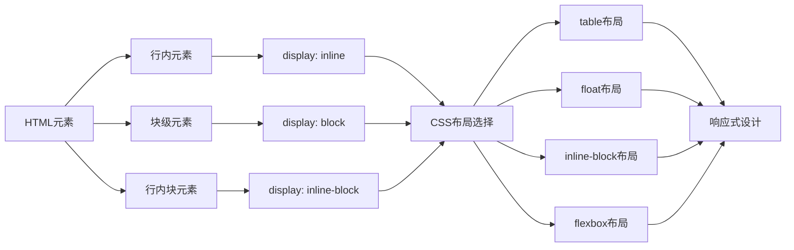
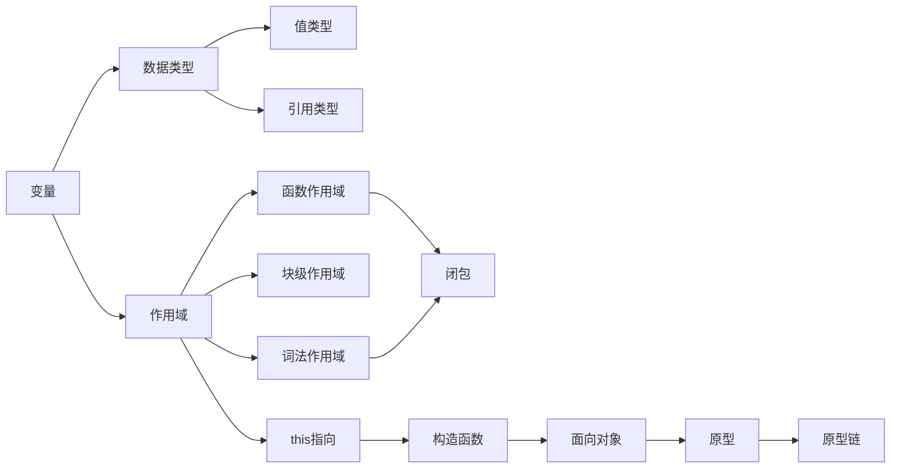

---
tags:
  - "#前端开发"
  - "#知识体系"
创建时间: 2026-01-29
更新时间: 2026-02-24T21:27
---
# 前端开发 知识体系总览

> 本笔记梳理了 前端开发 目录下所有记录的笔记，构建完整的知识体系，并建立各知识点之间的双链关系。
> 更新时间：2026-02-24（按新目录结构更新双链）

## 📊 知识体系架构

```
前端开发 (前端开发)
├── HTML (结构层) - 页面骨架
├── CSS (表现层) - 页面样式 ⭐重点
│   ├── 基础概念
│   ├── 选择器与权重
│   ├── 盒模型 ⭐核心
│   ├── 布局系统 ⭐核心重点
│   ├── 视觉与表现 ⭐新增
│   │   ├── 文本与字体
│   │   ├── 背景
│   │   ├── 边框与圆角
│   │   ├── 变化与过渡
│   │   └── CSS动画
│   ├── 响应式设计 ⭐必备
│   │   ├── 媒体查询
│   │   ├── 响应式单位
│   │   ├── 响应式图片
│   │   └── CSS响应式设计
│   ├── 现代 CSS 新特性 ⭐新增
│   └── 工程化
└── JavaScript (行为层) - 页面交互 ⭐重点
    ├── 基础语法
    │   ├── DOM - 文档对象模型
    │   ├── BOM - 浏览器对象模型
    │   └── JSON - 数据格式
    ├── 函数与作用域
    ├── 面向对象 ⭐核心
    ├── 数据类型 ⭐深入
    ├── 内置对象 ⭐新增
    │   ├── Math对象
    │   ├── 包装类型
    │   ├── Array
    │   └── Date对象
    └── 流程控制
```

---

## 🏗️ HTML - 结构层

> HTML 是页面的骨架结构，定义了页面的内容和语义。

### 核心笔记

| 笔记 | 简介 | 相关链接 |
|------|------|----------|
| [[01-基础知识体系/HTML标签]] | HTML基础标签的使用，包括 div、img、a、input、span、p 等 | [[06-响应式设计/行内元素与块元素]] |
| [[02-概念卡片/DOM]] | 文档对象模型，HTML 元素的 JavaScript 接口 | [[01-基础知识体系/HTML标签]] |
| [[02-概念卡片/BOM]] | 浏览器对象模型，浏览器 API 接口 | [[04-JavaScript深入/Window对象]] |
| [[02-概念卡片/JSON]] | JSON 数据格式与解析 | [[04-JavaScript深入/值类型和引用类型]] |

### 知识要点

- **文档结构**：`<!DOCTYPE>`、`<html>`、`<head>`、`<body>`
- **常用标签**：div、img、a、input、p、span、ul/ol、dl
- **行内元素 vs 块级元素**：理解 HTML 元素默认的布局行为

> 📌 **知识点关联**：HTML 的元素类型（行内/块级）直接影响 CSS 布局方式，参见 [[06-响应式设计/行内元素与块元素]]

---

## 🎨 CSS - 表现层

> CSS 控制页面的视觉表现，是前端开发的重点技能。

### 1️⃣ CSS 基础

| 笔记 | 简介 | 相关链接 |
|------|------|----------|
| [[03-CSS深入/CSS基础概念]] | CSS 的定义、引入方式、核心理解 | [[03-CSS深入/CSS引入方式]]、 [[03-CSS深入/CSS层叠、继承、值计算]] |
| [[03-CSS深入/CSS引入方式]] | 行内式、内嵌式、外链式 | - |
| [[03-CSS深入/CSS选择器]] | 基本选择器、属性选择器、关系选择器、伪类/伪元素 | - |
| [[03-CSS深入/CSS层叠、继承、值计算]] | CSS 权重计算、层叠性、继承特性 | [[03-CSS深入/CSS选择器]] |

### 2️⃣ 盒模型 ⭐核心

| 笔记 | 简介 | 相关链接 |
|------|------|----------|
| [[03-CSS深入/盒模型]] | 盒模型概念、width/height、padding、margin、box-sizing | [[06-响应式设计/行内元素与块元素]]、 [[03-CSS深入/CSS基础概念]] |

> 📌 **核心概念**：理解标准盒模型（content-box）和替代盒模型（border-box）对于精确控制元素尺寸至关重要。

### 3️⃣ 布局系统 ⭐⭐重点

> CSS 布局是前端开发的核心技能，从早期 table 布局到现在 flexbox/grid 布局。

| 笔记 | 简介 | 相关链接 |
|------|------|----------|
| [[05-布局系统/CSS布局系统]] | CSS 布局知识体系概览 | 全部布局笔记 |
| [[05-布局系统/table表格布局]] | 早期简单布局方式 | [[05-布局系统/float浮动+margin布局]] |
| [[05-布局系统/float浮动+margin布局]] | 传统 PC 端布局方式，需要处理高度塌陷 | [[05-布局系统/inline-block布局]]、 [[03-CSS深入/盒模型]] |
| [[05-布局系统/inline-block布局]] | 像文本一样排列，注意空白间隙问题 | [[06-响应式设计/行内元素与块元素]] |
| [[05-布局系统/flexbox布局]] | 现代弹性盒布局，一维布局利器 ⭐推荐 | [[06-响应式设计/响应式布局]] |
| [[06-响应式设计/响应式布局]] | 响应式设计核心方法论 | [[06-响应式设计/媒体查询]]、 [[06-响应式设计/响应式单位]] |

#### 布局技术演进

```
table表格布局 → float+margin → inline-block → flexbox → Grid（未来趋势）
```

### 4️⃣ 元素类型

| 笔记 | 简介 | 相关链接 |
|------|------|----------|
| [[06-响应式设计/行内元素与块元素]] | 行内元素、块级元素、行内块的特性与转换 | [[03-CSS深入/盒模型]]、 [[05-布局系统/inline-block布局]] |

### 5️⃣ 视觉与表现 ⭐新增

> CSS 视觉表现相关知识，包括字体、背景、边框、动画等效果。

| 笔记 | 简介 | 相关链接 |
|------|------|----------|
| [[03-CSS深入/CSS视觉与表现]] | CSS 视觉表现知识体系概览 | 以下全部笔记 |
| [[03-CSS深入/文本与字体]] | 字体控制、文本属性、溢出处理 | [[03-CSS深入/背景]] |
| [[03-CSS深入/背景]] | background-image、渐变、精灵图 | [[03-CSS深入/边框与圆角]] |
| [[03-CSS深入/边框与圆角]] | border、box-shadow、border-radius | [[03-CSS深入/变化与过渡]] |
| [[03-CSS深入/变化与过渡]] | transform、transition、perspective | [[03-CSS深入/CSS动画]] |
| [[03-CSS深入/CSS动画]] | @keyframes、animation动画 | - |

### 6️⃣ 响应式设计 ⭐必备

| 笔记 | 简介 | 相关链接 |
|------|------|----------|
| [[06-响应式设计/响应式布局]] | 响应式设计核心概念、viewport、rem、媒体查询 | [[06-响应式设计/媒体查询]]、 [[06-响应式设计/响应式单位]] |
| [[06-响应式设计/媒体查询]] | @media 语法、断点设计策略 | [[06-响应式设计/响应式布局]] |
| [[06-响应式设计/响应式单位]] | em、rem、%、vw/vh、vmin/vmax | [[06-响应式设计/媒体查询]] |
| [[06-响应式设计/响应式图片]] | srcset、sizes、picture 元素 | [[06-响应式设计/响应式布局]] |
| [[06-响应式设计/CSS响应式设计]] | 响应式设计知识体系概览 | 以上响应式笔记 |

#### 响应式三支柱

```
Viewport（视口）←→ Media Query（媒体查询）←→ rem（相对单位）
```

### 7️⃣ 现代 CSS 新特性 ⭐新增

| 笔记 | 简介 | 相关链接 |
|------|------|----------|
| [[07-工程化/现代 CSS 新特性]] | 容器查询、层叠层、子网格、CSS 逻辑属性 | - |
| [[07-工程化/CSS高级特性与新特性]] | CSS 变量、calc()、混合模式、clip-path | [[07-工程化/Less预处理器]]、 [[07-工程化/Sass预处理器]] |

### 8️⃣ CSS 工程化

| 笔记 | 简介 | 相关链接 |
|------|------|----------|
| [[07-工程化/CSS工程化]] | CSS 方法论、预处理器、后处理器、性能优化 | [[07-工程化/PostCSS]]、 [[07-工程化/Sass预处理器]]、 [[07-工程化/Less预处理器]] |
| [[07-工程化/PostCSS]] | CSS 处理工具链、Autoprefixer、CSS Modules | [[07-工程化/CSS工程化]] |
| [[07-工程化/Sass预处理器]] | Sass 语法、变量、嵌套、混合、继承 | - |
| [[07-工程化/Less预处理器]] | Less 语法、特性 | - |

---

## ⚡ JavaScript - 行为层

> JavaScript 为页面添加交互能力，是前端开发的核心编程语言。

### 1️⃣ JavaScript 基础

| 笔记 | 简介 | 相关链接 |
|------|------|----------|
| [[01-基础知识体系/邂逅JavaScript]] | JavaScript 历史、组成、运行引擎、应用场景 | - |
| [[01-基础知识体系/JavaScript基础概念]] | JS 知识体系索引 | [[01-基础知识体系/JavaScript基础]] |
| [[01-基础知识体系/JavaScript基础]] | JS 编写方式、注意事项、交互方式 | - |
| [[02-概念卡片/变量和数据类型]] | 变量定义、8种数据类型、类型转换 | [[04-JavaScript深入/值类型和引用类型]] |
| [[02-概念卡片/运算符]] | 算术、赋值、比较、逻辑、三目运算符 | [[02-概念卡片/流程控制语句]] |
| [[02-概念卡片/DOM]] | 文档对象模型，HTML 元素的 JavaScript 接口 | [[01-基础知识体系/HTML标签]] |
| [[02-概念卡片/BOM]] | 浏览器对象模型，浏览器 API 接口 | [[04-JavaScript深入/Window对象]] |
| [[02-概念卡片/JSON]] | JSON 数据格式与解析 | [[04-JavaScript深入/值类型和引用类型]] |

### 2️⃣ 函数与作用域 ⭐核心

| 笔记 | 简介 | 相关链接 |
|------|------|----------|
| [[04-JavaScript深入/函数]] | 函数定义、参数、返回值、函数表达式、递归 | [[04-JavaScript深入/作用域]]、 [[04-JavaScript深入/闭包]] |
| [[04-JavaScript深入/作用域]] | 全局作用域、函数作用域、块级作用域、提升、TDZ | [[04-JavaScript深入/函数]]、 [[04-JavaScript深入/闭包]] |
| [[04-JavaScript深入/闭包]] | 闭包概念、词法作用域、内存泄漏风险 | [[04-JavaScript深入/作用域]]、 [[04-JavaScript深入/函数]] |

> 📌 **知识点关联**：理解作用域是掌握闭包的前提，而闭包是 JavaScript 高级应用的基础。

### 3️⃣ this 与对象

| 笔记 | 简介 | 相关链接 |
|------|------|----------|
| [[04-JavaScript深入/This指向]] | this 指向规则（全局、构造函数、方法中） | [[04-JavaScript深入/面向对象]]、 [[04-JavaScript深入/函数]] |
| [[04-JavaScript深入/面向对象]] | 对象、构造函数、封装、继承、多态 | [[04-JavaScript深入/原型与原型链]]、 [[04-JavaScript深入/This指向]] |
| [[04-JavaScript深入/原型与原型链]] | 原型概念、原型链、原型对象、constructor | [[04-JavaScript深入/面向对象]]、 [[04-JavaScript深入/值类型和引用类型]] |

#### 面向对象与原型关系

```
构造函数 → prototype（原型） → 原型链 → 继承
```

### 4️⃣ 数据类型深入

| 笔记 | 简介 | 相关链接 |
|------|------|----------|
| [[04-JavaScript深入/值类型和引用类型]] | 栈内存 vs 堆内存、值类型 vs 引用类型 | [[02-概念卡片/变量和数据类型]] |
| [[04-JavaScript深入/包装类型]] ⭐新增 | Number、String 的实例方法和静态方法 | [[02-概念卡片/变量和数据类型]] |

### 5️⃣ 内置对象 ⭐新增

| 笔记 | 简介 | 相关链接 |
|------|------|----------|
| [[04-JavaScript深入/数学对象]] | Math 数学常量和数学方法 | [[02-概念卡片/运算符]] |
| [[04-JavaScript深入/数组]] | 数组的创建、操作方法、遍历、排序等 | [[04-JavaScript深入/值类型和引用类型]] |
| [[04-JavaScript深入/日期对象]] | Date 日期对象的创建、格式化、时区处理 | [[04-JavaScript深入/数学对象]] |

### 6️⃣ BOM

| 笔记 | 简介 | 相关链接 |
|------|------|----------|
| [[04-JavaScript深入/Window对象]] | window 对象、全局变量与全局属性 | - |

### 7️⃣ 流程控制

| 笔记 | 简介 | 相关链接 |
|------|------|----------|
| [[02-概念卡片/流程控制语句]] | 顺序、分支（if/switch）、循环（while/for） | [[02-概念卡片/运算符]] |

---

## 🔗 知识关联图谱

### HTML-CSS 关联



### JavaScript 核心概念关联



### CSS 视觉与动画关联 ⭐新增

```mermaid
graph LR
    A[CSS视觉与表现] --> B[文本与字体]
    A --> C[背景]
    A --> D[边框与圆角]
    A --> E[变化与过渡]
    A --> F[CSS动画]

    B --> G[font-family/color/text-align]
    C --> H[background-image/渐变]
    D --> I[border/border-radius/box-shadow]
    E --> J[transform/transition]
    F --> K[@keyframes/animation]

    J --> L[交互效果]
    K --> M[复杂动画]
```

---

## 📌 重点学习路径

### CSS 学习路径

1. **入门**：[[03-CSS深入/CSS引入方式]] → [[03-CSS深入/CSS选择器]] → [[03-CSS深入/CSS层叠、继承、值计算]]
2. **核心**：[[03-CSS深入/盒模型]] → [[06-响应式设计/行内元素与块元素]]
3. **布局**：[[05-布局系统/CSS布局系统]] → 依次学习各布局方式
4. **视觉表现**：[[03-CSS深入/CSS视觉与表现]] → [[03-CSS深入/文本与字体]] → [[03-CSS深入/背景]] → [[03-CSS深入/边框与圆角]] → [[03-CSS深入/变化与过渡]] → [[03-CSS深入/CSS动画]]
5. **进阶**：[[06-响应式设计/响应式布局]] → [[06-响应式设计/媒体查询]] → [[06-响应式设计/响应式单位]] → [[06-响应式设计/响应式图片]]
6. **现代特性**：[[07-工程化/现代 CSS 新特性]] → [[07-工程化/CSS高级特性与新特性]]
7. **工程化**：[[07-工程化/CSS工程化]] → [[07-工程化/PostCSS]]/[[07-工程化/Sass预处理器]]/[[07-工程化/Less预处理器]]

### JavaScript 学习路径

1. **基础**：[[01-基础知识体系/邂逅JavaScript]] → [[01-基础知识体系/JavaScript基础]] → [[02-概念卡片/变量和数据类型]] → [[02-概念卡片/运算符]]
2. **DOM/BOM**：[[02-概念卡片/DOM]] → [[02-概念卡片/BOM]] → [[02-概念卡片/JSON]]
3. **核心**：[[04-JavaScript深入/函数]] → [[04-JavaScript深入/作用域]] → [[04-JavaScript深入/闭包]] → [[04-JavaScript深入/This指向]]
4. **面向对象**：[[04-JavaScript深入/面向对象]] → [[04-JavaScript深入/原型与原型链]]
5. **数据类型**：[[04-JavaScript深入/值类型和引用类型]] → [[04-JavaScript深入/包装类型]]
6. **内置对象**：[[04-JavaScript深入/数学对象]] → [[04-JavaScript深入/数组]] → [[04-JavaScript深入/日期对象]] → [[02-概念卡片/变量和数据类型]]
7. **深入**：[[02-概念卡片/流程控制语句]]

---

## 🎯 核心技能总结

| 领域 | 核心技能 | 对应笔记 |
|------|----------|----------|
| **HTML** | 语义化标签、行内/块级元素理解 | [[01-基础知识体系/HTML标签]]、 [[06-响应式设计/行内元素与块元素]]、 [[02-概念卡片/DOM]] |
| **CSS** | 盒模型、Flexbox 布局、响应式设计、CSS动画 | [[03-CSS深入/盒模型]]、 [[05-布局系统/flexbox布局]]、 [[06-响应式设计/响应式布局]]、 [[03-CSS深入/CSS动画]] |
| **JavaScript** | 函数、原型与原型链、闭包、this、数组操作、DOM/BOM | [[04-JavaScript深入/函数]]、 [[04-JavaScript深入/原型与原型链]]、 [[04-JavaScript深入/闭包]]、 [[04-JavaScript深入/This指向]]、 [[04-JavaScript深入/数组]]、 [[02-概念卡片/BOM]] |

---

## 📚 扩展学习建议

- **CSS Grid**：未来布局趋势，可作为 flexbox 的补充
- **TypeScript**：JavaScript 超集，增加类型系统
- **前端框架**：React、Vue、Angular（基于 JS 的框架）
- **构建工具**：Webpack、Vite（[[07-工程化/CSS工程化]]中提到的 [[07-工程化/PostCSS]] 是其中一部分）
- **Canvas/WebGL**：[[03-CSS深入/CSS动画]] 之外的动画实现方式

---

> 💡 **使用提示**：点击上方双链可快速跳转到对应笔记，关系图谱展示了各知识点之间的逻辑联系。建议按照学习路径逐步深入，同时利用双链进行知识的关联复习。
>
> 📅 **更新日志**：
> - 2026-02-24：按新目录结构更新双链，新增 DOM、BOM、JSON、日期对象笔记
> - 2026-02-24：完善知识体系架构和学习路径
> - 2026-01-29：新增视觉与表现章节（文本与字体、背景、边框与圆角、变化与过渡、CSS动画）
> - 2026-01-29：新增内置对象章节（Math对象、包装类型、Array）
> - 2026-01-29：新增现代 CSS 新特性章节（容器查询、层叠层等）
