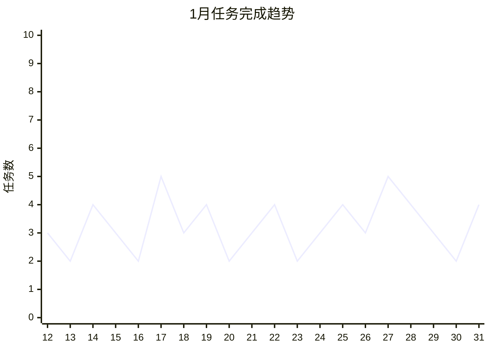

# 📊 2026年1月月度汇总

<< [[2025-12-月汇总]] | [[2026-02-月汇总]] >>

---

## 📈 月度概览

### 本月天数
- 记录天数：**20天**（1月12日 - 1月31日）

### 任务统计

```dataviewjs
const dailyNotes = dv.pages('"7.Daily 日周记"')
  .where(p => p.file.name.startsWith("2026-01"));

// 计算总任务和已完成任务
let totalTasks = 0;
let completedTasks = 0;

for (let page of dailyNotes) {
  if (page.file.tasks) {
    const tasks = page.file.tasks;
    totalTasks += tasks.length;
    completedTasks += tasks.filter(t => t.completed).length;
  }
}

const completionRate = totalTasks > 0 ? Math.round((completedTasks / totalTasks) * 100) : 0;

dv.paragraph(`
| 指标 | 数值 |
|------|------|
| 📝 总任务数 | ${totalTasks} |
| ✅ 已完成任务 | ${completedTasks} |
| ⏳ 未完成任务 | ${totalTasks - completedTasks} |
| 📊 完成率 | ${completionRate}% |
`);
```

### 学习日报统计

```dataview
TABLE date, focus_areas, time AS "学习时长"
FROM "7.Daily 日周记"
WHERE file.name =~ "学习日报" AND file.name startswith "2026-01"
SORT date ASC
```

---

## 🎯 核心成果

### ✅ 本月完成的重要事项

- [ ] Obsidian日记模版定版
- [ ] 学习JavaScript面向对象
- [ ] 学习JavaScript原型
- [ ] 解决了Obsidian集成quickadd添加常用Callout
- [ ] 取身份证

### 🔄 进行中的事项

- [ ] 学习JS #todo
- [ ] 前端技术栈学习

### 📋 未完成的任务

```dataview
TASK
FROM "7.Daily 日周记"
WHERE file.name.startswith("2026-01") AND !completed
GROUP BY file.link
```

---

## 💭 闪念记录汇总

```dataview
List
FROM "7.Daily 日周记"
WHERE file.name.startswith("2026-01") AND contains(file.content, "$")
SORT file.name ASC
```

---

## 📚 技术学习总结

### 本月学习主题

| 主题 | 状态 | 进度 |
|------|------|------|
| JavaScript面向对象 | ✅ 已学习 | 100% |
| JavaScript原型 | ✅ 已学习 | 100% |
| HTML/CSS基础 | 🔄 进行中 | - |
| 前端框架入门 | 🔄 待开始 | 0% |

### 学习时长统计

```dataviewjs
const studyNotes = dv.pages('"7.Daily 日周记"')
  .where(p => p.file.name.startsWith("2026-01-") && p.file.name.includes("学习日报"));

const timeData = {};
for (let note of studyNotes) {
  if (note.time) {
    timeData[note.date] = note.time;
  }
}

dv.paragraph("**每日学习时长记录：**");
for (let [date, time] of Object.entries(timeData)) {
  dv.paragraph(`- ${date}: ${time}`);
}
```

---

## 🔧 问题与解决方案

### 本月解决的问题

- Obsidian集成quickadd添加常用Callout
- Obsidian日记模版定版

### 遗留问题

- [ ] Obsidian侧面板显示任务汇总
- [ ] 常用图标汇总

---

## 📅 下月计划

### 🎯 重点目标

1. [ ] 继续前端技术栈学习
2. [ ] 完成JavaScript高级特性学习
3. [ ] 开始实际项目练习
4. [ ] 优化Obsidian工作流

### 📅 重要日期

| 日期 | 事项 |
|------|------|
| 2026-02-01 | 继续月度日记记录 |
| 2026-02-15 | 月中回顾 |

---

## 💡 反思与感悟

### 本月收获

1. 通过日记系统养成了每日记录的习惯
2. 建立了系统化的学习日报模板
3. 掌握了JavaScript面向对象和原型基础知识

### 需要改进

1. 任务完成率需要提升
2. 闪念记录可以更及时
3. 增加项目实战练习

---

## 📊 数据可视化

### 任务完成趋势



---

> 📝 *本月汇总生成于 2026-01-31*
