```mermaid
xychart-beta
    title "1月任务完æˆè¶‹åŠ¿"
    x-axis [12, 13, 14, 15, 16, 17, 18, 19, 20, 21, 22, 23, 24, 25, 26, 27, 28, 29, 30, 31]
    y-axis "任务数" 0 --> 10
    line [3, 2, 4, 3, 2, 5, 3, 4, 2, 3, 4, 2, 3, 4, 3, 5, 4, 3, 2, 4]
```

# 📊 2026年1月月度汇总

<< [[2025-12-月汇总]] | [[2026-02-月汇总]] >>

---

## 📈 月度概览

### 本月天数
- 记录天数：**20天**（1月12日 - 1月31日）

### 任务统计

```dataviewjs
const dailyNotes = dv.pages('"7.Daily 日周记"')
  .where(p => p.file.name.startsWith("2026-01"));

// 计算总任务和已完成任务
let totalTasks = 0;
let completedTasks = 0;

for (let page of dailyNotes) {
  if (page.file.tasks) {
    const tasks = page.file.tasks;
    totalTasks += tasks.length;
    completedTasks += tasks.filter(t => t.completed).length;
  }
}

const completionRate = totalTasks > 0 ? Math.round((completedTasks / totalTasks) * 100) : 0;

dv.paragraph(`
| 指标 | 数值 |
|------|------|
| 📝 总任务数 | ${totalTasks} |
| ✅ 已完成任务 | ${completedTasks} |
| ⏳ 未完成任务 | ${totalTasks - completedTasks} |
| 📊 完成率 | ${completionRate}% |
`);
```

### 学习日报统计

```dataviewjs
const studyNotes = dv.pages('"7.Daily 日周记"')
  .where(p => p.file.name.includes("学习日报") && p.file.name.startsWith("2026-01"));

if (studyNotes.length === 0) {
  dv.paragraph("*本月暂无学习日报记录*");
} else {
  const tableData = [];
  for (let note of studyNotes) {
    tableData.push([
      note.file.link,
      note.date || note.file.name.slice(0, 10),
      (note.focus_areas || []).join(", "),
      note.time || "-"
    ]);
  }
  dv.table(["笔记", "日期", "学习领域", "学习时长"], tableData);
}
```

---

## 🎯 核心成果

### ✅ 本月完成的重要事项

- [x] Obsidian日记模版定版 ✅ 2026-01-31
- [x] 学习JavaScript面向对象 ✅ 2026-01-31
- [x] 学习JavaScript原型 ✅ 2026-01-31
- [x] 解决了Obsidian集成quickadd添加常用Callout ✅ 2026-01-31
- [x] 取身份证 ✅ 2026-01-31

### 🔄 进行中的事项

- [ ] 学习JS 
- [ ] 前端技术栈学习

### 📋 未完成的任务

```dataview
TASK
FROM "7.Daily 日周记"
WHERE !completed AND contains(file.name, "2026-01-")
SORT file.name ASC
```

---

## 💭 闪念记录汇总

```dataviewjs
const notes = dv.pages('"7.Daily 日周记"')
  .where(p => p.file.name.startsWith("2026-01"));

const thoughts = [];
for (let note of notes) {
  const content = note.file.content || "";
  const lines = content.split("\n");
  for (let line of lines) {
    // 匹配 ~ 开头的闪念记录
    const match = line.match(/^[-*]\s*~\s*(.+)/);
    if (match) {
      thoughts.push({
        date: note.file.name.slice(0, 10),
        content: match[1].trim(),
        link: note.file.link
      });
    }
  }
}

if (thoughts.length === 0) {
  dv.paragraph("*本月暂无闪念记录*");
} else {
  const tableData = thoughts.map(t => [t.date, t.link, t.content]);
  dv.table(["日期", "来源", "闪念内容"], tableData);
}
```

---

## 📚 技术学习总结

### 本月学习主题

| 主题             | 状态     | 进度   |
| -------------- | ------ | ---- |
| JavaScript面向对象 | ✅ 已学习  | 100% |
| JavaScript原型   | ✅ 已学习  | 100% |
| HTML/CSS基础     | ✅ 已学习  | 100% |
| 前端框架入门         | 🔄 待开始 | 0%   |

### 学习时长统计

```dataviewjs
const studyNotes = dv.pages('"7.Daily 日周记"')
  .where(p => p.file.name.startsWith("2026-01-") && p.file.name.includes("学习日报"));

const timeData = {};
for (let note of studyNotes) {
  if (note.time) {
    timeData[note.date] = note.time;
  }
}

dv.paragraph("**每日学习时长记录：**");
for (let [date, time] of Object.entries(timeData)) {
  dv.paragraph(`- ${date}: ${time}`);
}
```

---

## 🔧 问题与解决方案

### 本月解决的问题

- Obsidian集成quickadd添加常用Callout
- Obsidian日记模版定版

### 遗留问题

- [ ] Obsidian侧面板显示任务汇总
- [ ] 常用Button汇总

---

## 📅 下月计划

### 🎯 重点目标

1. [ ] 继续前端技术栈学习
2. [ ] 完成JavaScript高级特性学习
3. [ ] 开始实际项目练习
4. [ ] 优化Obsidian工作流

### 📅 重要日期

| 日期 | 事项 |
|------|------|
| 2026-02-01 | 继续月度日记记录 |
| 2026-02-15 | 月中回顾 |

---

## 💡 反思与感悟

### 本月收获

1. 通过日记系统养成了每日记录的习惯
2. 建立了系统化的学习日报模板
3. 掌握了JavaScript面向对象和原型基础知识

### 需要改进

1. 任务完成率需要提升
2. 闪念记录可以更及时
3. 增加项目实战练习

---

## 📊 数据可视化

### 任务完成趋势



---

> 📝 *本月汇总生成于 2026-01-31*
