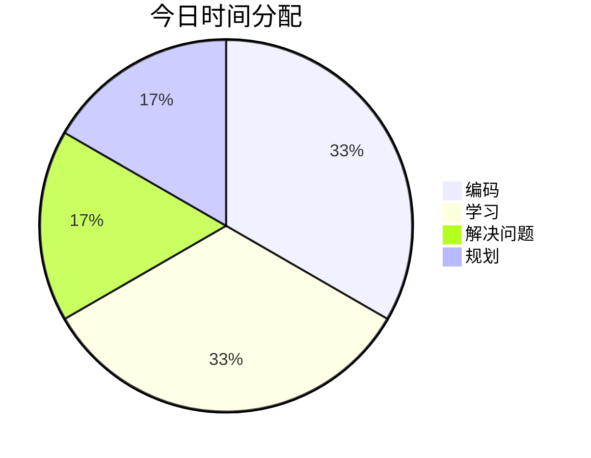

# {date} 学习日报

## ⏰ 时间分配



### 📋 项目进展

> [!info] 今日项目状态

```dataviewjs
const columns = ["待处理", "进行中", "已完成"];
const pages = dv.pages('#项目').where(p => !p.file.path.includes("Templates"));

for (let col of columns) {
    const filesInColumn = pages.where(p => p.状态 === col);
    dv.header(4, `**${col}** (${filesInColumn.length})`);

    if (filesInColumn.length > 0) {
        dv.list(filesInColumn.map(p => p.file.link));
    } else {
        dv.paragraph("*暂无*");
    }
}
```

## 📈 进度追踪

**进行中项目**：

```dataviewjs
const pages = dv.pages('#项目')
  .where(p => p.状态 === "进行中")
  .where(p => !p.file.path.includes("Templates"));

if (pages.length === 0) {
    dv.paragraph("当前没有进行中的项目");
} else {
    const tableData = pages.map(p => {
        const tasks = dv.pages(`"${p.file.path}"`).file.tasks || [];
        const completed = tasks.filter(t => t.completed).length;
        const total = tasks.length;
        const percent = total > 0 ? Math.round((completed / total) * 100) : 0;
        return [p.file.link, `${percent}%`, `${completed}/${total}`];
    });
    dv.table(["项目", "进度", "任务"], tableData);
}
```

## 📝 今日完成

-

### 🔧 问题解决

-

### 📚 技术学习

-

## 🎯 明日计划

-

---
*使用 QuickAdd (Ctrl+Shift+Q) 创建*
