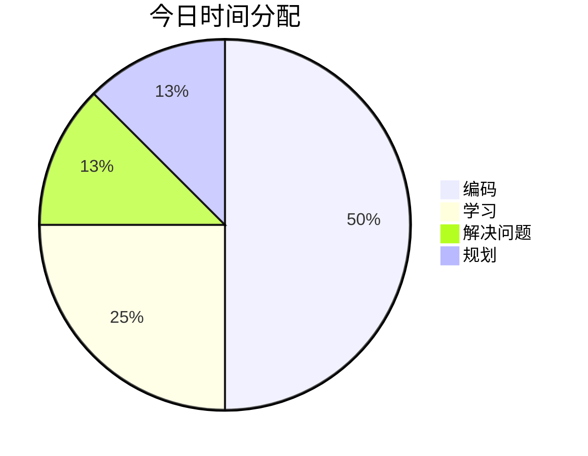

## ⏰ 时间分配

## 📝 今日完成

### 技术学习

- Vue3 Composition API实战练习

- TypeScript泛型深入学习

- 收获：掌握了TS高级类型的使用

### 项目进展

- 记账小程序首页开发

- 修复Canvas绘制性能问题

- 提交记录：`git commit -m "feat: 优化分享功能性能"`

### 问题解决

- **问题**：UniApp Canvas渲染模糊

- **解决**：使用2倍图+适配屏幕DPI

## 💡 今日收获

1. 学会了Canvas性能优化技巧

2. 理解了响应式更新的深层原理

3. 掌握了项目架构设计方法

## 🎯 明日计划

- 开发记账表单组件

- 学习Node.js Express框架

- 规划数据库设计

## 📈 进度追踪

**学习进度**：Vue掌握度 70% → 75%  
**项目进度**：MVP完成度 20% → 25%