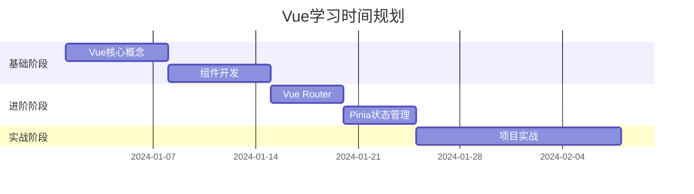

## 🎯 学习目标
**终极目标**：能够独立开发企业级Vue应用
**阶段目标**：
- [ ] 理解Vue核心概念（组件、响应式、生命周期）
- [ ] 掌握Vue Router和状态管理
- [ ] 熟练使用Vue3 Composition API
- [ ] 能够进行性能优化

## 📚 学习资源
### 核心课程
- [ ] Vue官方文档（精读）
- [ ] 项目实战：《Vue.js设计与实现》

### 配套练习
- [ ] 写一个Todo应用（基础）
- [ ] 开发电商后台管理系统（中级）
- [ ] 实现一个低代码平台组件（高级）

## ⏰ 时间安排

## 💡 关键知识点总结

### 核心概念

1. **响应式原理**：
```javascript
// 关键代码示例
const state = reactive({ count: 0 })
	```
### 常见问题解决方案

- **问题**：组件间通信复杂

- **解决方案**：使用provide/inject或Pinia


## 🔗 关联技术

- [[TypeScript]]

- [[UniApp]]

- [[Node.js]]