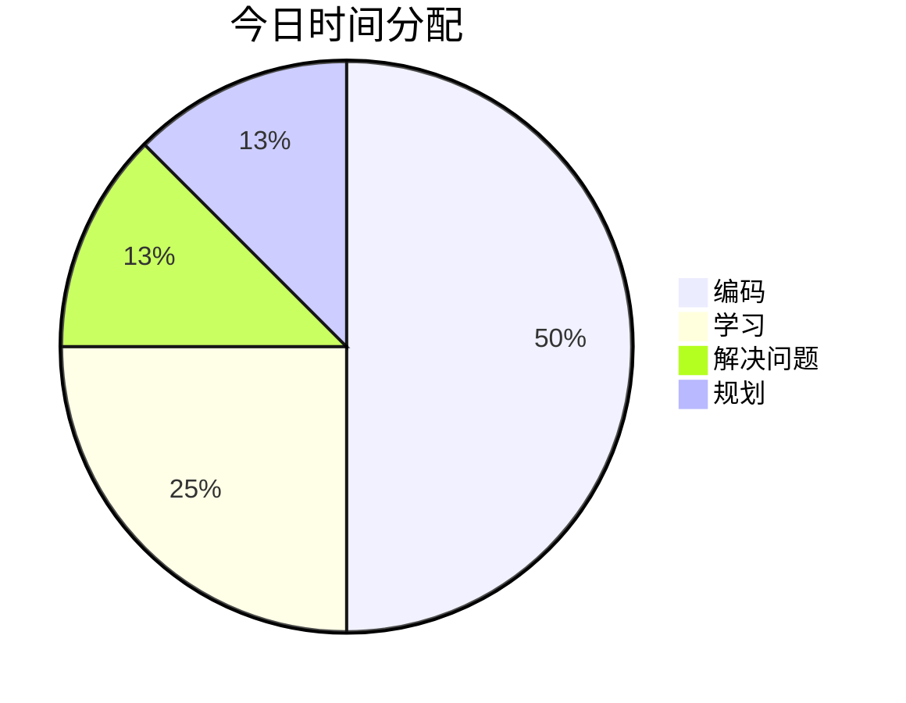

---
date:
  "{ date }":
focus_areas:
  - 前端
  - 后端
  - 学习
time: 8小时
tags:
  - 日报
---
## ⏰ 时间分配

## 📝 今日完成
- [ ] 

### 技术学习
- 

### 项目进展

### 问题解决

## 💡 今日收获

## 🎯 明日计划
- [ ] 

## 📈 进度追踪

**学习进度**：
**项目进度**：