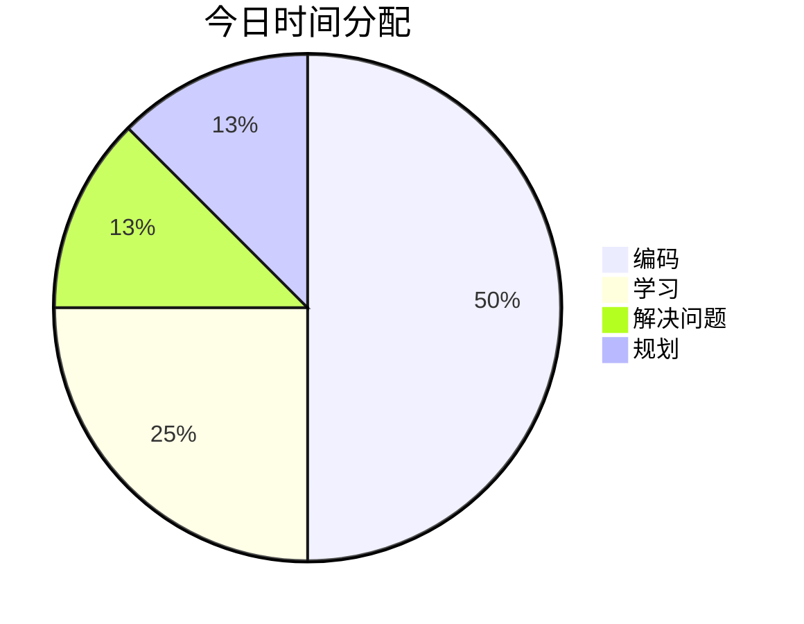

---
date:
  "{ date }":
focus_areas:
  - 前端
  - 后端
  - 学习
time: 8小时
tags:
  - 日报
---
## ⏰ 时间分配

## 📝 今日完成
- [ ] 

### 技术学习
- 

### 项目进展
```dataviewjs
// 1. 定义数据来源：可以按文件夹或标签筛选
// 示例A：获取指定文件夹下的所有笔记
const pages = dv.pages('"1-Projects"');
// 示例B：或获取包含特定标签（如#项目）的所有笔记
// const pages = dv.pages('#项目');

// 2. 定义看板的列，与你“状态”字段的值保持一致
const columns = ["待处理", "进行中", "已完成"];

// 3. 为每一列渲染卡片
for (let col of columns) {
    // 筛选出“状态”字段等于当前列名的笔记
    const filesInColumn = pages.where(p => p.状态 === col);
    
    // 渲染列标题（包含该列下的笔记数量）
    dv.header(3, col + ` (${filesInColumn.length})`);
    
    // 以列表形式渲染卡片，显示笔记链接和优先级（如果存在）
    dv.list(filesInColumn.map(p => {
        let display = p.file.link;
        if (p.优先级) {
            display += ` ➜ 优先级：${p.优先级}`;
        }
        return display;
    }));
}
```

### 问题解决


## 💡 今日收获


## 🎯 明日计划
- [ ] 

## 📈 进度追踪

**学习进度**：
**项目进度**：