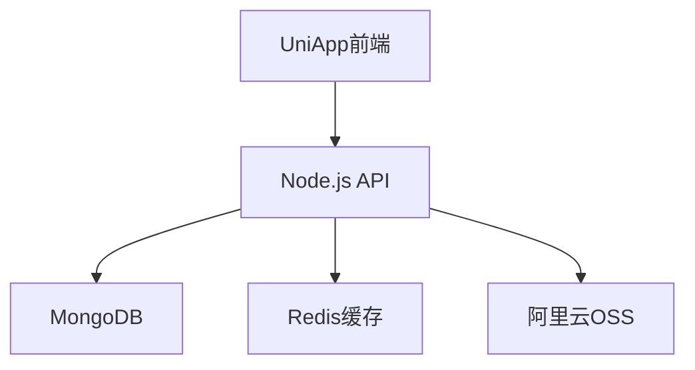

## 🎯 项目概述
### 市场分析
- **目标用户**：年轻人、自由职业者
- **竞品分析**：[[鲨鱼记账分析]]、[[MoneyWiz分析]]
- **差异化**：专注自由职业者税务管理

### 商业模式
- 基础功能免费
- 高级报表付费（99元/年）
- 税务咨询增值服务

## 📋 技术架构

## 📊 MVP功能清单

### 第一阶段（1个月）

- 基础记账功能

- 分类统计

- 数据导出

### 第二阶段（1个月）

- 多账本管理

- 报表分析

- 云同步

## 💰 成本预算
|项目|费用|备注|
|---|---|---|
|云服务器|500/年|阿里云ECS|
|域名备案|100/年||
|小程序认证|300/年||
|总计|900元||

## 📝 开发日志

### 2024-01-01

**完成**：项目初始化  
**问题**：UniApp对Vue3支持有坑  
**解决**：升级到HBuilderX 3.6+

## 🔗 相关文档

- [[项目需求文档]]
- [[API接口文档]]
- [[UI设计稿]]